# 🏗️ CodeGuardian Architecture

## System Overview

CodeGuardian is an autonomous AI security audit agent powered by Gemini 3. The system uses multi-agent orchestration, extended reasoning, and 1M token context windows to perform comprehensive security analysis.

## Architecture Diagram

```mermaid
graph TB
    subgraph "User Interface"
        CLI[CLI Interface<br/>main.py]
        WEB[Web Dashboard<br/>Flask + Alpine.js]
    end

    subgraph "Core AI Engine"
        GEMINI[Gemini 3 Client<br/>1M Token Context<br/>Thought Signatures]
        MARATHON[Marathon Agent<br/>Multi-hour Sessions<br/>State Persistence]
    end

    subgraph "Multi-Agent System"
        RED[🔴 Red Team Agent<br/>Offensive Security<br/>Find Vulnerabilities]
        BLUE[🔵 Blue Team Agent<br/>Defensive Security<br/>Generate Patches]
        BATTLE[⚔️ Adversarial Battle<br/>Orchestrator]
    end

    subgraph "Analysis Pipeline"
        ANALYZER[Code Analyzer<br/>AST Parsing<br/>Dependency Graphs]
        SCANNER[Vulnerability Scanner<br/>OWASP Top 10<br/>Deep Analysis]
        CHAIN[Chain Detector<br/>Attack Path Analysis]
        DEP[Dependency Scanner<br/>CVE Database<br/>Exploitability AI]
    end

    subgraph "Action Layer"
        FIX[Fix Generator<br/>Auto-patch Code]
        SIM[Attack Simulator<br/>Docker Sandbox<br/>Exploit Testing]
        COMP[Compliance Mapper<br/>OWASP/PCI/SOC2]
    end

    subgraph "Output Layer"
        REPORT[Report Engine<br/>HTML/JSON/TXT]
        VIZ[Visualization<br/>Diagrams/Charts]
        SCORE[Security Scoreboard<br/>Gamification]
    end

    CLI --> GEMINI
    WEB --> GEMINI
    GEMINI --> MARATHON
    
    MARATHON --> ANALYZER
    MARATHON --> RED
    MARATHON --> BLUE
    
    RED <--> BATTLE
    BLUE <--> BATTLE
    BATTLE --> GEMINI
    
    ANALYZER --> SCANNER
    ANALYZER --> DEP
    SCANNER --> CHAIN
    SCANNER --> GEMINI
    
    CHAIN --> FIX
    CHAIN --> SIM
    SCANNER --> COMP
    
    FIX --> GEMINI
    SIM --> GEMINI
    
    FIX --> REPORT
    CHAIN --> REPORT
    DEP --> SCORE
    SCANNER --> VIZ
    
    style GEMINI fill:#4285F4,color:#fff
    style RED fill:#ff4444,color:#fff
    style BLUE fill:#4444ff,color:#fff
    style BATTLE fill:#ff8800,color:#fff
    style MARATHON fill:#00aa44,color:#fff
```



## Component Details

### 1. **Gemini 3 Client** 🧠
- **File**: `src/core/gemini_client.py`
- **Features**:
  - 1M token context window for full codebase analysis
  - Thought Signatures with thinking levels 1-5
  - Extended reasoning chains
  - Security-specific analysis methods
- **Models**: `gemini-3-flash-preview`, `gemini-3-pro-preview`

### 2. **Marathon Agent** ⏱️
- **File**: `src/core/marathon_agent.py`
- **Features**:
  - Multi-hour autonomous operations
  - State persistence (checkpoints, decisions, errors)
  - Self-correction loops
  - Time-boxed execution with graceful degradation

### 3. **Multi-Agent System** ⚔️

#### Red Team Agent 🔴
- **File**: `src/agents/red_team.py`
- **Role**: Offensive security testing
- **Actions**:
  - Find vulnerabilities
  - Generate exploits
  - Bypass defenses
  - Think like an attacker

#### Blue Team Agent 🔵
- **File**: `src/agents/blue_team.py`
- **Role**: Defensive security
- **Actions**:
  - Patch vulnerabilities
  - Implement controls
  - Harden code
  - Think like a defender

#### Adversarial Battle Orchestrator ⚔️
- **File**: `src/agents/adversarial_battle.py`
- **Purpose**: Orchestrate Red vs Blue competition
- **Process**:
  1. Red Team finds vulnerabilities
  2. Blue Team patches them
  3. Red Team tries to bypass
  4. Repeat until convergence
- **Output**: Full transcript of battle with reasoning

### 4. **Analysis Pipeline** 🔍

#### Code Analyzer
- **File**: `src/analyzers/code_analyzer.py`
- AST parsing (Python, JavaScript, Java)
- Dependency graph construction
- Data flow identification
- Critical path detection

#### Vulnerability Scanner
- **File**: `src/scanners/vulnerability_scanner.py`
- OWASP Top 10 coverage
- File prioritization/triage
- Deep reasoning with Gemini
- Severity ranking

#### Dependency Scanner 📦
- **File**: `src/scanners/dependency_scanner.py`
- CVE database lookup
- **AI-powered exploitability analysis**
- Context-aware risk assessment
- Differentiates "has CVE" vs "actually exploitable"

### 5. **Action Layer** 🛠️

#### Fix Generator
- **File**: `src/generators/fix_generator.py`
- Automated patch generation
- Iterative refinement
- Test validation
- Self-correction on failures

#### Attack Simulator
- **File**: `src/simulators/attack_simulator.py`
- Docker sandbox for safe exploit testing
- Payload generation
- Exploit verification

### 6. **Output Layer** 📊

#### Report Engine
- **File**: `src/reporting/report_engine.py`
- HTML, JSON, TXT reports
- Comprehensive vulnerability details
- Remediation guidance

#### Security Scoreboard
- **File**: `src/reporting/security_dashboard.py`
- Security score calculation (0-100)
- Component breakdown:
  - Code Vulnerabilities (40%)
  - Dependency Security (30%)
  - Compliance (20%)
  - Fix Adoption (10%)
- Trend tracking over time

## Data Flow

### Typical Scan Flow:

```
1. User triggers scan
   ↓
2. Code Analyzer discovers files → parses AST → builds graphs
   ↓
3. Vulnerability Scanner triages files → deep scans with Gemini
   ↓
4. Chain Detector identifies exploitable attack chains
   ↓
5. (Optional) Fix Generator creates patches → tests them
   ↓
6. (Optional) Attack Simulator validates exploits in sandbox
   ↓
7. Report Engine generates comprehensive report
   ↓
8. Security Scoreboard calculates overall security score
```

### Red vs Blue Battle Flow:

```
ROUND 1:
  Red Team analyzes code → finds vulnerabilities
    ↓
  Blue Team patches vulnerabilities → hardens code
    ↓
  Updated code becomes input for Round 2

ROUND 2:
  Red Team tries to bypass patches → finds new issues (or none)
    ↓
  Blue Team improves defenses
    ↓
  Continue...

CONVERGENCE:
  No vulnerabilities found for N consecutive rounds
  OR max rounds reached
```

## Key Innovations

### 1. **Contextual CVE Analysis** 🎯
Unlike traditional scanners that just flag CVEs, CodeGuardian uses Gemini 3 to:
- Analyze if the vulnerable function is actually used in your code
- Determine if user input flows to the vulnerable code path
- Assess real exploitability in your specific context

### 2. **Multi-Agent Adversarial Testing** ⚔️
Two AI agents compete:
- Red Team finds vulnerabilities → Blue Team patches
- Red Team tries to bypass → Blue Team hardens
- Continues until code is secure
- Generates engaging narrative transcript

### 3. **Extended Reasoning** 🧠
Uses Gemini 3's Thought Signatures:
- Thinking Level 1-2: Quick analysis
- Thinking Level 3-4: Deep security reasoning
- Thinking Level 5: Complex attack chain analysis

### 4. **1M Token Context** 📚
Analyzes entire codebases in one context:
- No chunking or truncation
- Understands full data flows
- Tracks variables across files

## Technology Stack

- **AI**: Gemini 3 Flash/Pro Preview (Google)
- **Languages**: Python 3.10+
- **Parsing**: AST, ESLint, JavaParser
- **Web**: Flask, Alpine.js, Tailwind CSS
- **Visualization**: Mermaid, Chart.js
- **Testing**: Docker (sandbox), pytest
- **CVE Data**: NVD, Safety DB

## Performance

- **Typical scan**: 30-60 seconds for small projects
- **Red vs Blue battle**: 50-90 seconds per round
- **Dependency analysis**: 5-10 seconds for CVE lookup + AI analysis
- **Marathon operations**: Can run for hours with checkpoints

## Scalability

- **Files**: Optimized for projects with 100-1000 files
- **LOC**: Handles up to 50K lines efficiently
- **Tokens**: 1M token context (Gemini 3 limit)
- **Concurrency**: Batched processing with controlled parallelism

## Future Enhancements

1. **Real-time Dashboard**: WebSocket streaming of analysis progress
2. **Multi-language**: Full support for JavaScript, Java, Go, Rust
3. **CI/CD Integration**: GitHub Actions, GitLab CI plugins
4. **Team Collaboration**: Multi-user dashboard with shared findings
5. **Learning Mode**: Learns from false positives to improve accuracy
